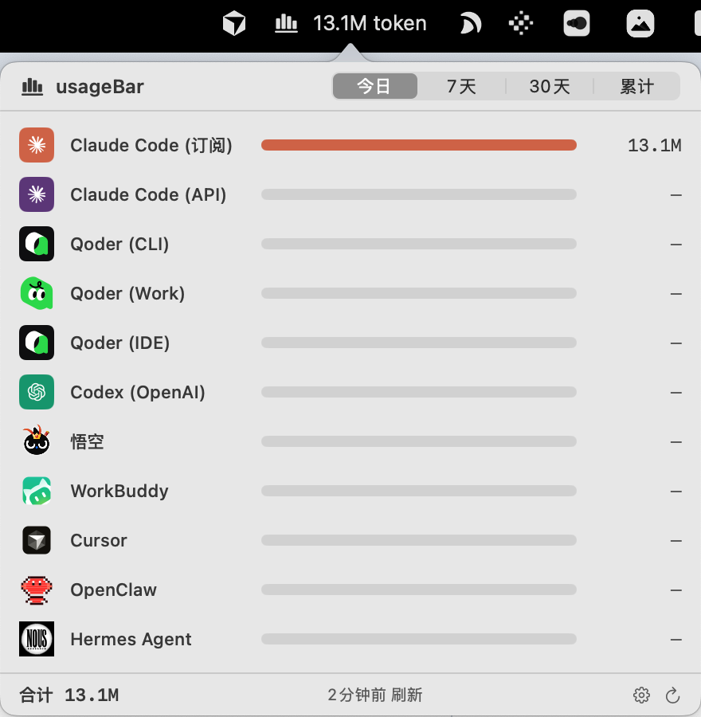

# usageBar

> macOS 菜单栏工具，聚合显示多个 AI 编程工具（Claude Code / Codex / Qoder / 悟空 等）的 token 用量，全本地直读、零配置。

**Swift 6 · macOS 14+ · Apple Silicon**

在 macOS 状态栏一眼看到你今天 / 近 7 天 / 近 30 天 / 累计在各个 AI 编程工具上烧了多少 token。除 Cursor 外，所有数据都从各工具落在本地的会话记录（jsonl / SQLite）直接读取，**不联网、不抓包、装上即用**。

> 🥇 **GitHub 上唯一一个把 Qoder 全家桶（CLI / Work / IDE）token 全部打通可计量的项目。** 三条产品线各自落盘的格式完全不同（npm transcript jsonl / 应用日志 mirror / SQLite），usageBar 把它们统一读出来，一个菜单栏就能看全。



## 支持的 Provider

| Provider | 数据源 | 说明 |
|---|---|---|
| Claude Code（订阅） | `~/.claude/projects/**/*.jsonl` | 按 `message.id` 前缀 `msg_01` 识别 Anthropic 直连 |
| Claude Code（API） | 同上 | `msg_vrtx_` / `msg_bdrk_` 前缀（Vertex / Bedrock 代理） |
| **Qoder（CLI）** 🥇 | `~/.qoder/projects/**/*.jsonl` | npm `qodercli` 1.0.x+ transcript，完整 4 列 |
| **Qoder（Work）** 🥇 | `~/Library/Application Support/QoderWork/logs/<ts>/main.log` | 增量 mirror 到本地 jsonl，精确 input/output 两列 |
| **Qoder（IDE）** 🥇 | `~/Library/Application Support/Qoder/SharedClientCache/.../local.db` | 直读 SQLite `chat_message.token_info` |
| Codex（OpenAI） | rollout jsonl | **累计值**，跨窗口做差分 |
| 悟空 | 本地 jsonl | flat 结构，毫秒时间戳 |
| WorkBuddy | `~/.workbuddy/projects/**/*.jsonl` | Claude Code 风格会话记录 |
| Cursor | Cursor 服务端 API | ⚠️ **唯一联网** provider（本地无真实 token，必须联网拉取） |
| OpenClaw | 本地（mtime 增量） | 社区个人 AI Agent |
| Hermes | `~/.hermes/state.db` | Hermes Agent（NousResearch），SQLite |

> 🥇 标记的三行 = **Qoder 全家桶**：CLI、Work、IDE 三条线全部覆盖，目前 GitHub 上仅此一家做到全部可计量。
>
> 各工具的 "token" 口径不完全一致（有的含 cache 拆分、有的只有 input/output），所以条形图长度是**量级参考**，不是严格同口径对比。

状态栏右键 → 偏好设置，可自定义每个 provider 的可见性。

## 技术亮点

- **Codex 跨窗口差分**：Codex 的 rollout 是 session 累计值，按相邻事件差分归到日期桶，避免跨天 session 被重复计算（否则会虚报十几倍）。
- **持久账本**：会话文件被删 / 轮转后，其历史 token 仍计入累计——消耗发生过就保留，不会因源文件消失而丢失。
- **mtime/size 增量缓存**：只重读发生变化的文件，刷新快、CPU 占用低。

## 安装

### 给人类：下载即用

> 仅支持 **Apple Silicon（M1/M2/M3/M4）**，暂无 Intel 版本。

1. 到 [Releases](../../releases) 下载 **`usageBar.dmg`**
2. 双击打开，把 `usageBar.app` **拖进 Applications 文件夹**

> ✅ 已做 Apple **Developer ID 签名 + 公证**，双击即开，无需任何额外放行步骤。
> （也提供 `usageBar.zip`：解压出 `.app` 拖进 `/Applications`，效果相同。）

### 给 AI Agent：让它帮你装

1. 到 [Releases](../../releases) 下载 `install-usagebar.zip`
2. 解压到 AI Agent 的 skill 目录，例如 Claude Code：`~/.claude/skills/install-usagebar/`
3. 跟 AI 说"装一下 usageBar"，它会自动跑 `scripts/install.sh`（解压 .app → 清 Gatekeeper 隔离 → 拷到 `/Applications` → 启动）

诊断 / 卸载等更多用法见 [`install-usagebar/README.md`](install-usagebar/README.md)。

## 工程结构

```
usageBar/
├── app/                       SwiftPM 工程
│   ├── Package.swift
│   ├── Sources/
│   │   ├── usageBar/          主 App：NSStatusItem + SwiftUI popover
│   │   ├── usageBarCore/      协议层：Provider 协议 + 数据模型 + 增量缓存
│   │   └── usageBarProviders/ 各 provider 实现
│   └── Scripts/               打包脚本
├── icon/                      App 图标资源
└── install-usagebar/          安装 / 诊断 / 卸载 skill
```

## 自己构建 / 审计代码

usageBar 会读取你本地 AI 工具的会话数据。虽然发布版已做 Developer ID 签名 + 公证，但如果你想彻底放心，可以自己 clone 下来构建、审计源码：`cd app && swift build`，详见 [`app/SETUP.md`](app/SETUP.md)。

## 反馈 & 支持

- 有 bug、想法或想要的功能，欢迎提 [Issue](../../issues)。
- 如果 usageBar 帮到了你，**点个 Star ⭐ 就是最好的支持**。

## License

[MIT](LICENSE) © ChanningYuan
