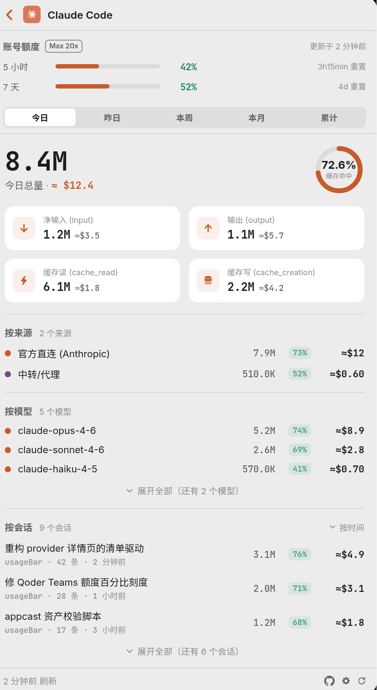

# usageBar

> macOS 菜单栏工具，聚合显示 13 个 AI 编程工具（Claude Code / Cowork / Codex / Cursor / Qoder 全家桶 / 千问办公 / 悟空 等）的 token 用量与账号额度，全本地直读、零配置。

**Swift 6 · macOS 14+ · Apple Silicon**

在 macOS 状态栏一眼看到你今天 / 近 7 天 / 近 30 天 / 累计在各个 AI 编程工具上烧了多少 token。token 统计除 Cursor 外都直接读取各工具落在本地的会话记录（jsonl / SQLite）；账号额度和千问办公积分历史属于可选联网能力，首次开启会明确提示授权。

除 token 用量外，还会显示**账号额度**（订阅套餐的用量上限与已用比例、重置时间），额度数据同样优先走本地已有的凭证与缓存。

> 🥇 **GitHub 上唯一一个把 Qoder 全家桶（CLI / Work / IDE）token 全部打通可计量的项目。** 三条产品线各自落盘的格式完全不同（npm transcript jsonl / 应用日志 mirror / SQLite），usageBar 把它们统一读出来，一个菜单栏就能看全。

<table>
<tr>
<td width="50%" valign="top">

<sub><b>菜单栏一览</b> — 12 个工具的用量条形图 + 缓存命中率，合计直接显示在菜单栏上</sub>
</td>
<td width="50%" valign="top">

<sub><b>点进去看细节</b> — 账号额度与重置时间、Token 四维构成、按来源 / 按模型 / 按会话拆分与等效花费</sub>
</td>
</tr>
</table>

## 支持的 Provider

| Provider | 数据源 | 说明 |
|---|---|---|
| Claude Code | `~/.claude/projects/**/*.jsonl` | 订阅 / API / 云渠道 / 中转都落在同一份日志里，主列表统一聚合；**官方直连与中转代理的拆分在详情页「按来源」区**（v0.3.21 起，此前的订阅 / API 二分是错的口径） |
| **Claude Cowork** ⭐ | `~/Library/Application Support/Claude/local-agent-mode-sessions/**/.claude/projects/**/*.jsonl` | 每个 Cowork 会话在自己的沙箱里跑一个 Claude Code，落盘格式与主目录一致。**主流工具（ccusage 等）只扫 `~/.claude/projects`，会漏掉 Cowork** |
| **Qoder（CLI）** 🥇 | `~/.qoder/projects/**/*.jsonl` | npm `qodercli` 1.0.x+ transcript，完整 4 列 |
| **Qoder（Work）** 🥇 | `~/Library/Application Support/QoderWork/logs/<ts>/main.log` | 增量 mirror 到本地 jsonl，精确 input/output 两列 |
| **Qoder（IDE）** 🥇 | `~/Library/Application Support/Qoder/SharedClientCache/.../local.db` | 直读 SQLite `chat_message.token_info` |
| **千问办公** | 本地 segment + 可选 `qwenwork.cn/user/billings` | 逐请求去重；精确 input/output/cache read（当前协议无 cache write）；账单缓存支持按周期查看真实积分消耗 |
| Codex（OpenAI） | rollout jsonl | **累计值**，跨窗口做差分 |
| 悟空 | 本地 jsonl | flat 结构，毫秒时间戳 |
| WorkBuddy | `~/.workbuddy/projects/**/*.jsonl` | Claude Code 风格会话记录 |
| Cursor | Cursor 服务端 API | ⚠️ **唯一联网** provider（本地无真实 token，必须联网拉取） |
| OpenClaw | 本地（mtime 增量） | 社区个人 AI Agent |
| Hermes | `~/.hermes/state.db` | Hermes Agent（NousResearch），SQLite |
| OpenCode | `$XDG_DATA_HOME/opencode/opencode.db`（默认 `~/.local/share/opencode/`） | SQLite（WAL 模式）直读 |

> 🥇 标记的三行 = **Qoder 全家桶**：CLI、Work、IDE 三条线全部覆盖，目前 GitHub 上仅此一家做到全部可计量。
>
> Qoder CLI / Work / 千问办公默认把 token 真值关闭。usageBar 会在检测到本地会话后提示一键设置 `QODER_EXPOSE_TOKEN_USAGE=1`（Qoder）与 `QODERCN_EXPOSE_TOKEN_USAGE=1`（千问办公）；只对开启后的新请求生效，两个桌面 app 需重启。
>
> 各工具的 "token" 口径不完全一致（有的含 cache 拆分、有的只有 input/output），所以条形图长度是**量级参考**，不是严格同口径对比。

状态栏右键 → 偏好设置，可自定义每个 provider 的可见性。

## 技术亮点

这类工具最难的不是把数字读出来，是**读得准**。各家落盘格式没有一个是为"被第三方统计"设计的，踩过的坑基本都长在这上面：

- **累计型数据的差分归桶**：Codex 的 rollout 和 Cursor 的用量事件都是**累计快照**而非增量，直接相加会虚报十几倍。Codex 按相邻事件差分归到日期桶；Cursor 的本地 mirror 从「追加日志」改成**按 key 覆盖的快照表**，同一 key 只留 total 最大的终值——顺带把存量里被污染的中间快照就地收敛，所以升级后即使不联网刷新，数字也已经是对的。
- **Claude Cowork 的沙箱嵌套扫描**：Cowork 每个会话在自己的沙箱里跑一个 Claude Code，日志落在 `local-agent-mode-sessions/**/.claude/projects/` 而不是主目录。只扫 `~/.claude/projects` 的工具（ccusage 等）会**整块漏掉**这部分消耗。
- **远程价目表**：`usagebar.cn/pricing.json` 由服务器 cron 每日从 models.dev 全量瘦身生成，app 每日一次 ETag 条件拉取（304 零流量）。新模型上市**不用发版**就能算出等效花费；同时构建时内置一份快照兜底，网络被企业安全软件拦截时也不会全变 $0。
- **账号额度零弹窗**：优先搭 Claude Code 自身 statusline 的便车读额度（引导时注入一行写命令），**不起进程、不弹系统授权框**；读不到就显示空态，绝不为了拿数据而回落到需要弹框授权的通道。
- **持久账本**：会话文件被删 / 轮转后，其历史 token 仍计入累计——消耗发生过就保留，不会因源文件消失而丢失。
- **千问办公积分历史**：缓存官网 `/user/billings` 与 `/user/billings/computer` 的真实扣减；同一会话账单增长时按新旧金额做差，把增量归到本次观察周期，既不重复计费，也不把跨周新消耗算回旧周。缓存位于 `~/Library/Application Support/usageBar/qwen-work-billings.json`，只保存规范化账单、账号哈希与差分流水，不保存登录凭证。
- **mtime/size 增量缓存**：只重读发生变化的文件，刷新快、CPU 占用低。

## 安装

### 给人类：下载即用

> 仅支持 **Apple Silicon（M1/M2/M3/M4）**，暂无 Intel 版本。

1. 到 [Releases](../../releases) 下载 **`usageBar.dmg`**
2. 双击打开，把 `usageBar.app` **拖进 Applications 文件夹**

> ✅ 已做 Apple **Developer ID 签名 + 公证**，双击即开，无需任何额外放行步骤。
> （也提供 `usageBar.zip`：解压出 `.app` 拖进 `/Applications`，效果相同。）

### 给 AI Agent：一句话装

把这句话发给你的 AI（Claude Code / Cursor 等）——它会自动下载、验签、装好并启动，你啥都不用下：

> 照着 https://usagebar.cn/skill.md 给我装一下 usageBar

全程可见可审计：从官方镜像下载**已公证**的 `.app` → `spctl` 验签 → 装到 `/Applications` → 启动。

> 🔄 **自动更新**：0.2.0 起内置 Sparkle——装好后会自动检查新版并提示一键升级，右键菜单也有"检查更新…"。

## 工程结构

```
usageBar/
├── app/                       SwiftPM 工程
│   ├── Package.swift
│   ├── Sources/
│   │   ├── usageBar/          主 App：NSStatusItem + SwiftUI popover
│   │   ├── usageBarCore/      协议层：Provider 协议 + 数据模型 + 增量缓存
│   │   └── usageBarProviders/ 各 provider 实现
│   └── Scripts/               打包脚本
└── icon/                      App 图标资源
```

> 「给 AI 装」的 skill 托管在 [usagebar.cn/skill.md](https://usagebar.cn/skill.md)（不在仓库内）。

## 自己构建 / 审计代码

usageBar 会读取你本地 AI 工具的会话数据。虽然发布版已做 Developer ID 签名 + 公证，但如果你想彻底放心，可以自己 clone 下来构建、审计源码：`cd app && swift build`，详见 [`app/SETUP.md`](app/SETUP.md)。

## 反馈 & 支持

- 有 bug、想法或想要的功能，欢迎提 [Issue](../../issues)。
- 如果 usageBar 帮到了你，**点个 Star ⭐ 就是最好的支持**。

## License

[MIT](LICENSE) © ChanningYuan
